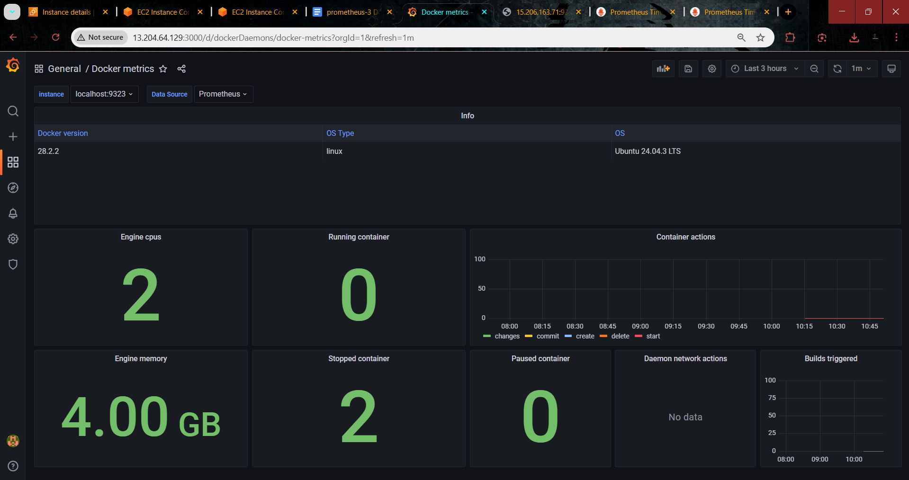
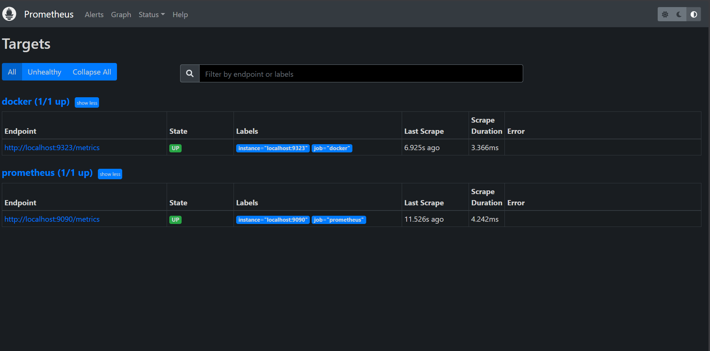

# Docker Monitoring using Prometheus & Grafana

## 📌 Project Overview

This project demonstrates how to monitor Docker containers using:

- 🐳 Docker
- 🔥 Prometheus
- 📊 Grafana
- ☁️ Ubuntu (EC2 / Virtual Machines)

The setup collects Docker daemon metrics using Prometheus and visualizes them through Grafana dashboards.

---

## 🏗️ Architecture

Docker Server (Prometheus Machine)
- Docker installed
- Prometheus installed
- Docker metrics exposed on port 9323
- Prometheus running on port 9090

Grafana Monitoring Machine
- Grafana installed
- Connected to Prometheus as data source
- Running on port 3000

---

## 🚀 Technologies Used

- Docker
- Prometheus v2.x
- Grafana v8.x
- Ubuntu Linux
- AWS EC2 (Cloud Setup)

---

## ⚙️ Ports Used

| Service          | Port  |
|-----------------|-------|
| Grafana         | 3000  |
| Prometheus      | 9090  |
| Docker Metrics  | 9323  |

---

## 🛠️ Setup Steps

### 1️⃣ Install Docker (Docker Server)

```bash
sudo apt update
sudo apt install docker.io -y
sudo service docker start
```

Enable Docker metrics:

```bash
sudo vi /etc/docker/daemon.json
```

Add:

```json
{
  "metrics-addr" : "0.0.0.0:9323",
  "experimental" : true
}
```

Restart Docker:

```bash
sudo service docker restart
```

---

### 2️⃣ Install Prometheus

```bash
wget https://github.com/prometheus/prometheus/releases/download/v2.34.0/prometheus-2.34.0.linux-amd64.tar.gz
tar zxvf prometheus-2.34.0.linux-amd64.tar.gz
cd prometheus-2.34.0.linux-amd64
```

Edit `prometheus.yml`:

```yaml
- job_name: "docker"

  static_configs:
    - targets: ["localhost:9323"]
```

Start Prometheus:

```bash
./prometheus
```

Access:
```
http://<docker-server-ip>:9090
```

---

### 3️⃣ Install Grafana (Monitoring Machine)

```bash
wget https://dl.grafana.com/enterprise/release/grafana-enterprise-8.4.4.linux-amd64.tar.gz
tar -zxvf grafana-enterprise-8.4.4.linux-amd64.tar.gz
cd grafana-8.4.4
./bin/grafana-server
```

Access:
```
http://<grafana-ip>:3000
```

Default Login:
```
Username: admin
Password: admin
```

---

## 🔗 Connect Grafana to Prometheus

1. Go to **Configuration → Data Sources**
2. Select **Prometheus**
3. Add URL:

```
http://<docker-server-ip>:9090
```

4. Click **Save & Test**

---

## 📊 Monitoring Dashboard Output

### 📌 Grafana Docker Metrics Dashboard



✔ Displays:
- Docker Engine CPU
- Engine Memory
- Running Containers
- Stopped Containers
- Container Actions

---

### 📌 Prometheus Target Status



✔ Shows:
- Docker target (9323) → UP
- Prometheus target (9090) → UP
- Successful scrape status

---

## 📊 Sample Prometheus Queries

Running Containers:
```
engine_daemon_container_states_containers{state="running"}
```

Stopped Containers:
```
engine_daemon_container_states_containers{state="stopped"}
```

---

## 📈 Import Prebuilt Docker Dashboard

Grafana Dashboard ID:
```
21040
```

Steps:
- Go to **Create → Import**
- Enter ID: `21040`
- Select Prometheus as data source
- Load Dashboard

---

## ✅ Project Outcome

✔ Successfully exposed Docker daemon metrics  
✔ Prometheus scraped Docker metrics  
✔ Grafana visualized real-time container statistics  
✔ Monitoring dashboard deployed on AWS EC2  

---

## 📚 Learning Outcomes

- Container monitoring fundamentals
- Prometheus configuration
- Grafana dashboard integration
- Docker daemon metrics exposure
- DevOps monitoring workflow

---

## 👨‍💻 Author

Suman M  
---

## ⭐ If you found this useful, consider giving it a star!
